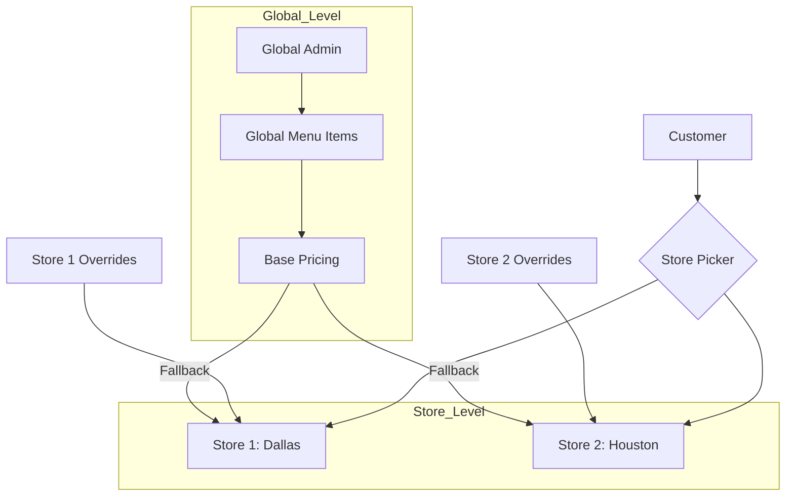

# 🏢 Multi-Store System Design (FJH-120)

## 📖 Overview
The Flame Japanese Hibachi platform is designed as a **Multi-Tenant / Multi-Location** application. This design ensures that while we maintain a single codebase and database, each franchise location (Shop) can operate independently with its own menu prices, staff, and operating hours.

## 📐 System Architecture


## 📋 Technical Requirements Breakdown

### 1. FJH-85: Data Structure Definition
To support multi-tenancy, the following relational rules are enforced:
*   **Primary Key Isolation**: All operational models (`Order`, `CartItem`, `Staff`, `MenuCategory`) must include a `shopId` foreign key.
*   **Model Relations**:
    *   `Shop`: The root entity containing location headers, addresses, and status.
    *   `ShopSettings`: Specific configurations like `taxRate`, `deliveryRadius`, and `isAcceptingOrders`.

### 2. FJH-87: Multiple Location Handling
*   **Routing Strategy**: We utilize **dynamic segment routing** (e.g., `fjh.com/[shop-slug]/menu`).
*   **Middleware Detection**: A Next.js Middleware intercepts requests to check for a `selected_shop` cookie. If missing, it triggers a redirect to the `/location-picker`.

### 3. FJH-88: Data Override Engine (Global vs Store-Level)
This ensures pricing consistency while allowing local inventory control.
*   **Priority Logic**: `Store_Override` > `Global_Default`.
*   **Restricted Access**: 
    *   **Prices & Data**: Only **Global Admins** can set or override prices for specific stores.
    *   **Stock/Availability**: **Store Admins** can only toggle `isAvailable` status (e.g., marking an item as "Sold Out" locally).
*   **Implementation**: A `ShopItemSettings` table stores overrides with strict **RBAC checks** on the price fields.

### 4. FJH-89: Selection & Persistence Logic
*   **Storage**: `localStorage` for UI state and **Encrypted HttpOnly Cookies** for server-side availability.
*   **Persistence**: Once a store is selected, the cart is "locked" to that location to prevent cross-location order errors.

---

## 👨‍💻 Developer Implementation Guide

### Store Context Provider
Developers should use the `useShop` hook to access the current shop context across the application:
```typescript
const { currentShop, isLoading } = useShop();
```

### Data Fetching Pattern
Always include the `shopId` in your Prisma queries:
```typescript
const items = await prisma.menuItem.findMany({
  where: {
    shopId: currentShop.id,
    isAvailable: true,
  }
});
```

---
**Status:** Architecture Defined ✅ | **Implementation Stage:** Phase 2 (Shop Management)
**Parent Task:** [FJH-120 Planning Phase](../roadmap/README.md)
