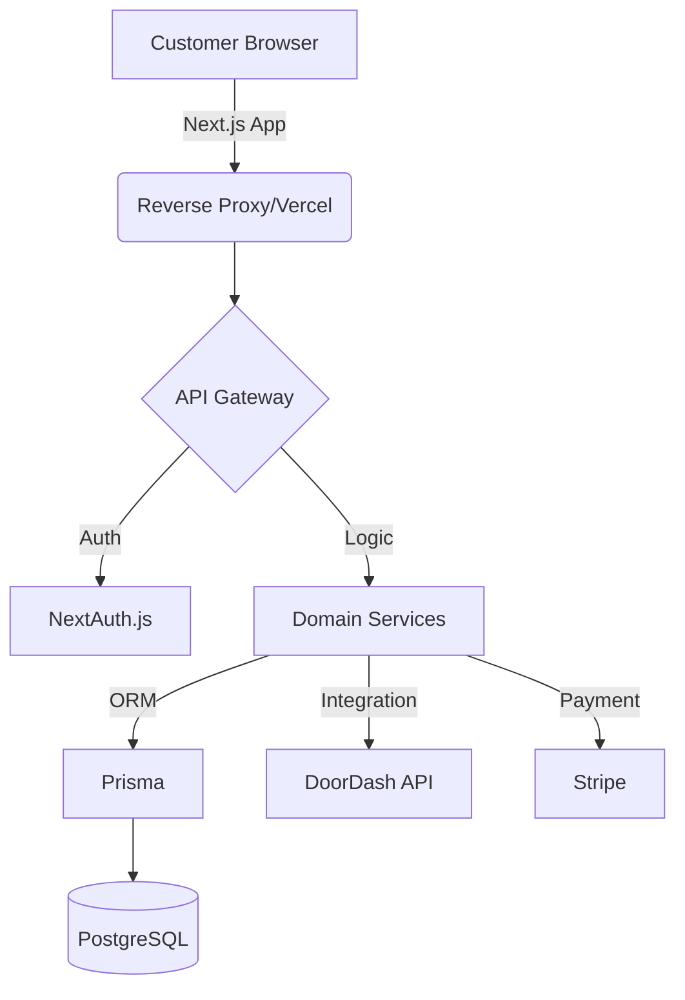

# 🚀 Flame Japanese Hibachi (FJH)

A premium, production-ready restaurant management platform. FJH powers multi-location hibachi operations with high-performance ordering, intelligent staff workflows, and deep analytics.

**Quick Links:** [📊 Project Status](./STATUS.md) | [🗺️ Roadmap](./roadmap/README.md) | [📚 API Docs](#api-documentation) | [🛡️ Security](#-security--compliance)

---

## 📖 Table of Contents

- [Overview](#-overview)
- [✨ Key Features](#-key-features)
- [🏗️ Technical Architecture](#-technical-architecture)
- [📁 Project Structure](#-project-structure)
- [🚀 Quick Start (5 Min)](#-quick-start-5-min)
- [🛠️ Development Workflow](#-development-workflow)
- [📚 API Documentation](#-api-documentation)
- [🔐 Security & Compliance](#-security--compliance)
- [🧪 Testing & Quality](#-testing--quality)
- [📊 Monitoring & Operations](#-monitoring--operations)
- [🤝 Contributing](#-contributing)

---

## 🎯 Overview

**Flame Japanese Hibachi (FJH)** is a comprehensive restaurant management system designed for scale. Unlike basic ordering apps, FJH provides a "Modular Monolith" foundation that bridges the gap between customer experience and kitchen efficiency.

| Persona | Solution |
| :--- | :--- |
| **Customers** | Fast, responsive menu browsing & real-time order tracking. |
| **Store Staff** | High-efficiency Kitchen Display System (KDS) & inventory management. |
| **Admins** | Multi-unit reporting, global menu control, and RBAC management. |

---

## ✨ Key Features

### 🛒 Customer-Facing
- **Multi-Location Menu:** Dynamic menu filtering based on selected shop availability.
- **Smart Cart:** Stateful shopping experience with support for complex modifiers.
- **Order Tracking:** Real-time progression from "Preparing" to "Ready for Pickup".
- **DoorDash Integration:** Seamless delivery handoff for off-premise orders.

### 🏪 Operational Control
- **Inventory Overrides:** Manage stock levels and prices per location without duplicating data.
- **Role-Based Access:** Granular permissions for Super Admins, Shop Managers, and Staff.
- **Audit Logging:** Every critical administrative action is tracked for compliance.

---

## 🏗️ Technical Architecture

### System Flow


### Module Design
We use a **Modular Monolith** pattern. This ensures that while the codebase is in a single repository for simplicity, domain boundaries (Auth, Order, Menu) are strictly respected, allowing for an easy future transition to microservices if needed.

---

## 📁 Project Structure

```bash
Flame-Japanese-Hibachi-FJH/
├── 📂 app/                            # Next.js App Router (Routes & Pages)
├── 📂 components/                     # Atomic Design UI Components
├── 📂 lib/                            # Shared Services (DB, Auth, API Clients)
├── 📂 prisma/                         # Schema & Migrations
├── 📂 roadmap/                        # Detailed Task Tracking & Data Models
├── 📂 Multi-Store System Design/      # FJH-120 Specifications
├── 📂 Role & CMS System Design/       # FJH-94 Specifications
├── 📂 Authentication & Session Design/# FJH-96 Specifications
├── 📂 External Services & Communication Design/# FJH-107 Specifications
├── 📂 Payment & Transaction Flow Design/# FJH-102 Specifications
├── 📂 .github/                        # PR/Issue Templates & Workflows
├── 📄 .env.example                    # SECURE YOUR SECRETS!
└── 📄 STATUS.md                       # Real-time project health dashboard
```

---

## 🚀 Quick Start (5 Min)

### 1. Requirements
- Node.js 18+ & PostgreSQL 15+

### 2. Initialization
```bash
git clone https://github.com/sunitsen/Flame-Japanese-Hibachi-FJH.git
cd Flame-Japanese-Hibachi-FJH
npm install
```

### 3. Environment
```bash
cp .env.example .env.local
# Edit .env.local with your local DB credentials
```

### 4. Database Sync
```bash
npx prisma migrate dev --name init
npx prisma db seed
```

### 5. Launch
```bash
npm run dev
```

---

## 📚 API Documentation

FJH uses a RESTful API built on Next.js API Routes. All endpoints return JSON and require `Authorization: Bearer <JWT>` for protected resources.

| Endpoint | Method | Purpose | Access |
| :--- | :---: | :--- | :--- |
| `/api/auth/login` | `POST` | Authenticate user & get session | Public |
| `/api/locations` | `GET` | List all active restaurants | Public |
| `/api/menu/:shopId`| `GET` | Get shop-specific menu | Public |
| `/api/orders` | `POST` | Place a new order | Customer |
| `/api/admin/shops` | `POST` | Create a new location | SuperAdmin |

> [!TIP]
> Use the [API_REFERENCE.md](./docs/API_REFERENCE.md) (📝 TODO) for detailed request/response schemas.

---

## 🔐 Security & Compliance

We prioritize data integrity and user privacy at every layer:
- **Authentication:** Managed via NextAuth.js with JWT session encryption.
- **RBAC:** Granular "Permission String" arrays stored per user-store assignment.
- **SQLi Prevention:** Prisma ORM handles all query parameterization.
- **CORS:** Strict policy allowing only verified origin domains.
- **PII Protection:** Hashing of sensitive data and minimal storage of customer info.

---

## 🧪 Testing & Quality

Maintaining a high standard of code quality through automated checks.
- **Unit Testing:** `Vitest` for business logic and utility functions.
- **Component Testing:** `React Testing Library` for UI validation.
- **Type Safety:** 100% TypeScript coverage with `strict` mode enabled.
- **Linting:** Standardized ESLint rules with Prettier formatting.

```bash
# Run the full test suite
npm test
# Run TypeScript compilation check
npm run type-check
```

---

## 📊 Monitoring & Operations

- **Logging:** `Pino` for structured logging across environments.
- **Error Tracking:** Support for `Sentry` for real-time frontend/backend error reporting.
- **Performance:** Vercel Analytics for Core Web Vitals monitoring.
- **Backups:** Daily automated PostgreSQL snapshots.

---

## 🤝 Contributing

sudo service postgresql status  # Linux
brew services list             # macOS

# Test connection
psql -U postgres -d fjh_development

# Reset connection
npx prisma db push
```

#### Port 3000 Already in Use
```bash
# Find process using port 3000
lsof -i :3000

# Run on different port
npm run dev -- -p 3001
```

#### Type Errors After Schema Changes
```bash
# Regenerate Prisma types
npx prisma generate

# Check for type issues
npm run type-check
```

#### Migration Fails
```bash
# Reset database (development only!)
npx prisma migrate reset

# Or manually resolve conflict
npx prisma migrate resolve --rolled-back migration_name
```

---

## 📄 License

This project is licensed under the MIT License. See the [LICENSE](LICENSE) file for details.

---

## 📞 Support & Contact

- **Issues:** [GitHub Issues](https://github.com/sunitsen/Flame-Japanese-Hibachi-FJH/issues)
- **Discussions:** [GitHub Discussions](https://github.com/sunitsen/Flame-Japanese-Hibachi-FJH/discussions)
- **Email:** support@fjh.local

---

## 🙏 Acknowledgments

Built with passion by the FJH team using modern web technologies.

---

**Last Updated:** 2026-04-16 | **Status:** Active Development 🚀